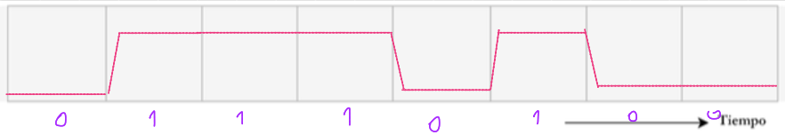
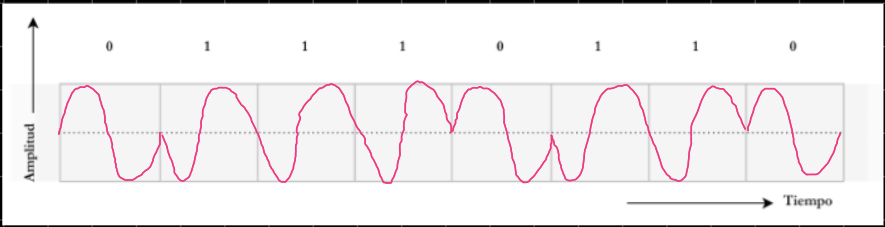
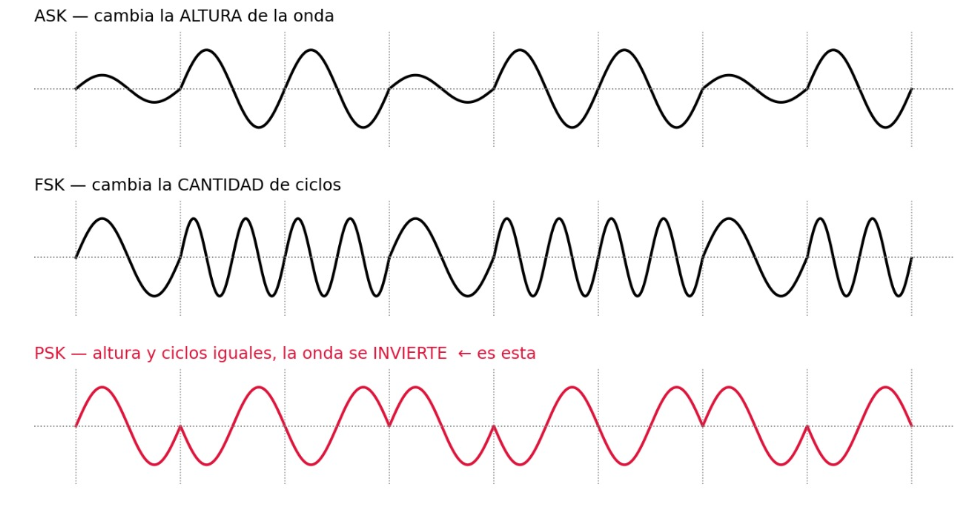
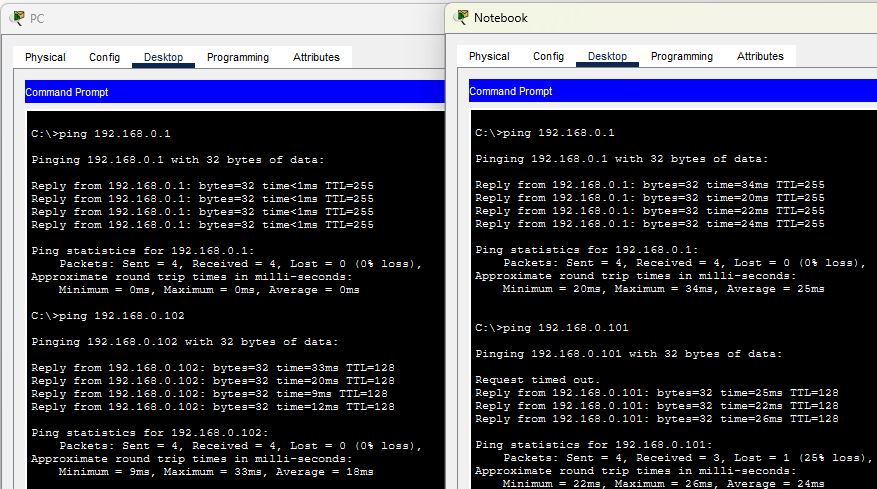
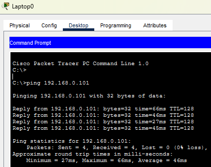
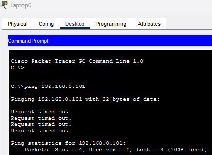

# Laboratorio 1 — Redes y Computadoras

**Universidad Nacional de Córdoba**
Facultad de Ciencias Exactas, Físicas y Naturales

**Grupo:** Lost Pointer

**Alumnos:**
- Catini Mariano
- Provenzale Lorenzo
- Vallenari Tizziano
- Bogni Luciano
- Caldera Pedro
- Macagno Santiago

---

## 1) Ondas electromagnéticas y atenuación

### Conceptos previos

#### Ondas electromagnéticas

Una onda electromagnética es una perturbación periódica de campos eléctricos y magnéticos que se propaga por el espacio (incluso en el vacío) a la velocidad de la luz. Se caracteriza por su frecuencia f, su longitud de onda λ y su amplitud.

#### Modulación / Demodulación

Modular consiste en variar una o más propiedades —amplitud, frecuencia o fase— de una señal periódica de alta frecuencia (la portadora), en función de una señal de información de menor frecuencia (la moduladora), con el fin de poder transmitirse eficientemente por un medio guiado o no guiado.

La demodulación es el proceso inverso: recuperar la señal de información original a partir de la señal modulada recibida.

#### Señales de tiempo continuo

Son aquellas cuya amplitud está definida para todo instante de tiempo dentro de un intervalo (dominio continuo), como una onda senoidal analógica. Típicamente representan datos analógicos (voz, video, señales de sensores), aunque también pueden transportar datos digitales mediante modulación sobre una portadora continua.

#### Señales de tiempo discreto

Son aquellas cuya amplitud sólo está definida en instantes discretos de tiempo (muestras), separados por un intervalo de muestreo fijo.

### a) Lectura del gráfico

En el gráfico se observa una onda periódica cuya envolvente (línea roja punteada) decrece con la distancia. Las marcas indican que dos mínimos (valles) consecutivos de la onda están separados 60 mm el uno del otro (60 mm y 120 mm), por lo que es la distancia entre dos puntos de igual fase en ciclos consecutivos.

### b) Cálculo de la frecuencia

λ = 0,06 m (dato leído del gráfico). Como la onda viaja a la velocidad de la luz, c = f·λ, entonces:

f = c / λ = (3×10⁸ m/s) / (0,06 m) = 5×10⁹ Hz = **5 GHz**

### c) Región y banda del espectro

5 GHz corresponde a la región de las microondas dentro del espectro de radiofrecuencia. Según la clasificación en bandas de la UIT (ITU-R), 5 GHz cae dentro de la banda **SHF** (Super High Frequency / Frecuencia Super Alta), que abarca de 3 GHz a 30 GHz.

### d) Dispositivos que operan en esa banda

Los dispositivos que operan en la banda de frecuencia super alta (SHF) son los que operan con antenas parabólicas, como los radares modernos o las redes de internet de 5G.

### e) Significado de la línea roja

La línea roja es la envolvente de atenuación: muestra cómo la amplitud máxima de la señal va disminuyendo mientras más distancia recorre.

### f) ¿Es un problema en la práctica?

Por supuesto, es un problema cotidiano que todos tenemos: mientras uno más se aleja de las antenas de 5G (o de un router), peor señal e internet tiene.

### g) Atenuación en otros medios

#### i) Telefonía celular

Sí, las transmisiones de telefonía celular son muy afectadas por la atenuación, de forma similar a como se describió con las señales 5G.

#### ii) Cables de cobre

También. En este caso la señal no viaja por medios "naturales" como el aire, por lo que los factores a los que se atribuye la atenuación están más relacionados con las limitaciones físicas del material que compone a estos cables. En términos de distancia, la atenuación es similar: mientras más largo el cable, más atenuación se sufre, similar a como se sufre mayor atenuación al alejarse más de la antena del 5G.

#### iii) Fibra óptica

También, pero en muchísima menor medida. La señal de la luz se debilita mientras más distancia viaja a través del cable debido a impurezas o variaciones en el vidrio. Una característica importante es que, a diferencia de las otras tecnologías, la atenuación no afecta la velocidad de transmisión: la transmisión siempre funciona a su máxima velocidad.

---

## 2) Transmisión y codificación de datos

### a) Direccionalidad y características temporales

Según su direccionalidad, se trata de una transmisión **simplex**, donde las señales se transmiten solo en una única dirección, con una estación emisora y otra receptora. En cuanto a las características temporales, se ven señales digitales (ya que la intensidad no varía y son pulsos cuadrados), siendo la inferior una señal periódica y la superior una señal no periódica.

### b) Aptitud del paradigma para alta velocidad

Si estoy buscando transmitir datos rápidamente y de forma bidireccional, este no es el mejor paradigma, ya que precisamos de una transmisión **full-duplex** para que ambas estaciones puedan transmitir y recibir simultáneamente. Algunos factores a tener en cuenta si deseamos transmitir a alta velocidad son el ruido, la distorsión de retardo y la atenuación.

### c) Codificación del carácter

Nuestro grupo se llama "Lost Pointer 2.0", siendo la 4ta letra de este nombre la letra "t". La letra T en ASCII vale 74 en hexadecimal, o sea, **01110100**.

### d) Momento de medición de los niveles de tensión

Sería óptimo medir los niveles de tensión recién en las marcas "intermedias" como T4, de modo de poder asegurarnos que estamos midiendo la tensión en el nivel asignado al 1 y no en ningún nivel intermedio.

---

## 3) Técnicas de modulación digital

No es conveniente transmitir directamente una señal escalonada de forma inalámbrica porque sus cambios bruscos generan muchas frecuencias y requieren un ancho de banda grande. Además, durante la transmisión puede sufrir ruido, interferencias y distorsiones, haciendo que la señal recibida sea diferente a la original y dificultando distinguir los valores 0 y 1. Por eso, en las comunicaciones inalámbricas se suelen utilizar técnicas de modulación para adaptar la señal digital al medio de transmisión.

### a) Identificación de la técnica

La técnica es **PSK** (Phase Shift Keying), más precisamente **BPSK** (Binary Phase Shift Keying), porque solo usa dos fases.

Nos dimos cuenta ya que la onda mantiene siempre la misma altura y la misma cantidad de ciclos por bit, así que no puede ser ni ASK ni FSK. Lo único que cambia es la fase: cada vez que el bit pasa de 0 a 1 o de 1 a 0, la onda se da vuelta 180° y queda ese quiebre en punta sobre la línea media. Cuando vienen dos bits iguales seguidos (1 y 1), en cambio, la onda sigue de largo sin ningún quiebre. Acá el 0 va con fase 0° y el 1 con fase 180°.

### b) Señal resultante para la nueva secuencia

La señal se vería igual de pareja que la anterior: misma altura de onda en todo el gráfico y una onda completa por cada bit. Lo único que cambia es que en algunos lugares la onda se da vuelta. Como el 0 arranca para arriba y el 1 para abajo, cada vez que el bit cambia de valor aparece un quiebre en punta sobre la línea del medio. Con esta secuencia eso pasa cuatro veces: al pasar del 0 al 1, después del 1 al 0, de nuevo del 0 al 1 y al final del 1 al 0. Donde vienen varios 1 seguidos, la onda sigue derecho, sin ningún quiebre.

### c) Otras técnicas basadas en el mismo principio

**Por amplitud:** además de ASK está el OOK (On-Off Keying), que es básicamente un ASK donde uno de los dos símbolos tiene amplitud directamente nula; y el QAM, que combina variaciones de amplitud con variaciones de fase para meter más bits por símbolo (se usa en Wi-Fi, cable módem, etc.).

**Por frecuencia:** FSK, que usa dos (o más) frecuencias distintas para representar los símbolos manteniendo la amplitud fija, y variantes como GFSK, que suaviza las transiciones (Bluetooth la usa).

**Por fase:** PSK, con sus variantes BPSK (1 bit por símbolo), QPSK (2 bits), 8-PSK (3 bits), y DPSK, que en vez de una fase absoluta codifica el cambio de fase respecto del símbolo anterior.

### d) BER y comparación entre técnicas

El **BER** (Bit Error Rate) es la tasa de error de bit: la cantidad de bits recibidos con error dividida por la cantidad total de bits transmitidos. Indica la calidad del enlace; cuanto más bajo, mejor.

En términos de BER, la que mejores prestaciones tiene es PSK. Como sus dos símbolos son opuestos entre sí (0° y 180°), quedan lo más separados posible y, por lo tanto, hace falta mucho ruido para que el receptor confunda uno con otro. FSK queda en el medio, porque sus símbolos son ortogonales y no opuestos, lo que la obliga a usar aproximadamente el doble de potencia para lograr el mismo BER. ASK es la de peor desempeño, ya que el ruido afecta directamente a la amplitud, que es justamente donde está guardada la información.

---

## 4) Prácticas con red Wi-Fi

### c) Configuración del router

El router opera a 2.437 GHz (canal 6), frecuencia que corresponde a la región de las microondas en el espectro electromagnético, específicamente a la banda de Super Alta Frecuencia, abarcando típicamente el rango de 2.4 GHz a 2.4835 GHz.

### g) Direcciones IP y verificación de conectividad

La IP de la PC es 192.168.0.101 y la IP de la Notebook es 192.168.0.102. A continuación se muestra una captura de que la conexión es efectiva tanto con el router como entre ambas:

### h) Pruebas de conexión según la posición

Realizando las pruebas de conexión con la PC desde las posiciones propuestas, se observan los siguientes resultados.

**Posición 1:**

**Posición 2:**

La conclusión que sale rápidamente es que fuera del rango de la señal Wi-Fi la conexión entre la laptop y la PC no es efectiva. La prueba de ping que realizamos devuelve que de los datos enviados el 100% se ha perdido, a diferencia de cuando sí se encontraba dentro del rango de la señal Wi-Fi, donde la pérdida de datos era del 0%.
