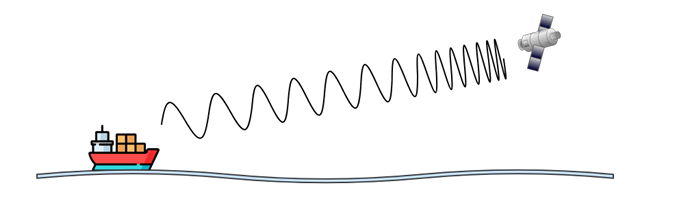
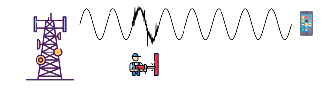

# Laboratorio 2 — Redes y Computadoras

**Universidad Nacional de Córdoba**
Facultad de Ciencias Exactas, Físicas y Naturales

**Grupo:** Lost Pointer

**Alumnos:**
- Catini Mariano
- Provenzale Lorenzo
- Vallenari Tizziano
- Bogni Luciano
- Caldera Pedro
- Macagno Santiago

---

## 1) Efecto Doppler



### a) Fenómeno representado y sus características

En la figura se está representando el **efecto Doppler** mediante una onda cuya frecuencia aumenta a medida que se acerca al satélite, esto es porque hay un movimiento relativo entre emisor y receptor. Algunas de sus características principales son:

- Si el emisor y el receptor se acercan, la frecuencia percibida aumenta (las ondas se comprimen), y si se alejan disminuye (las ondas se estiran).
- Cuanto más rápido se muevan el emisor o el receptor, más se desvía la frecuencia de la señal original.
- Si la frecuencia se desvía demasiado por la velocidad, el receptor no logra enganchar la señal y la transmisión de datos se interrumpe.

### b) Tipos de transmisión afectados y resiliencia

Algunas de las bandas vistas en el TP01 son las microondas y la banda **SHF** (Super High Frequency), como la señal de 5 GHz, redes 5G, etc.

Este fenómeno afecta más a las bandas de frecuencia alta (como la SHF). Al ser frecuencias tan elevadas, el movimiento genera una desviación en Hertz considerable, haciendo que el receptor pierda la sincronización con la onda. En cambio, en las bandas de frecuencia más bajas (como la VHF) la desviación en Hertz es insignificante, por lo que la conexión no se pierde.

### c) Por qué no se debe encender el celular en un avión

Las razones principales son:

- Las ondas emitidas por el celular pueden generar ruido e interferencia en los sistemas de comunicación de los pilotos y en instrumentos como los radioaltímetros.
- Saturación de antenas terrestres.

Esto se relaciona con el efecto Doppler porque al movernos tan rápido la señal del celular sufre un cambio de frecuencia muy grande en Hertz. Las redes móviles están diseñadas para autos o personas caminando, por lo que no pueden procesar semejante desviación de frecuencia, generando que la conexión falle y la red funcione peor.

---

## 2) Ruido en el canal



### a) Fenómeno representado

Acá lo que se representa es el **ruido en el canal**. Se ve una señal que sale limpia y periódica desde la torre, pero en algún punto del trayecto se le suma algo que no debería estar: una perturbación no deseada que se mete entre el emisor y el receptor y le baja la calidad a la señal que finalmente llega al celular. De hecho el ruido es, en general, el factor que más limita cuánto puede rendir un sistema de comunicación.

### b) Tipos de transmisión afectados y resiliencia

La transmisión digital a alta velocidad es la que más sufre el **ruido impulsivo**, porque un pulso de ruido de una duración fija termina abarcando más bits cuanto más rápido se transmite (cada bit dura menos tiempo). En cuanto al medio, los enlaces no guiados (radio, microondas, celular, satelital) son en general más vulnerables al ruido externo que los medios guiados.

### c) SNR y su relación con el BER

La **SNR** es la relación señal a ruido: el cociente entre la potencia de la señal y la potencia del ruido en un punto dado del sistema, casi siempre medida en el receptor.

A mayor SNR, menos chances hay de que el ruido termine confundiendo al receptor al momento de interpretar un bit, así que el BER baja a medida que la SNR sube.

---

## 3) Detección/corrección de errores y compensación de frecuencia

Para detectar y corregir errores producidos por ruido, los sistemas digitales le agregan **redundancia** a los datos. La versión más simple son los bits de paridad o un checksum, que le permiten al receptor darse cuenta si algo cambió en el camino.

Para compensar cambios de frecuencia se usan técnicas de **recuperación de reloj y de portadora**: codificaciones que se autosincronizan (como Manchester, que asegura una transición por bit y facilita recuperar el reloj), lazos PLL, y circuitos de control automático de frecuencia que van corrigiendo el oscilador local del receptor todo el tiempo para que no se desenganche de la portadora que le está llegando.

---

## 4) Interpretación de la información decodificada

### a) Qué significa sincronizarse

Sincronizarse, en una comunicación digital, es básicamente que el receptor se alinee en el tiempo con lo que le está llegando para poder interpretarlo bien. Hay dos niveles distintos.

La **sincronización de bits** es la más básica: el reloj del receptor tiene que quedar alineado con la velocidad de transmisión del emisor para poder muestrear la señal justo en el instante correcto de cada bit.

La **sincronización de trama** es un paso más: una vez que ya se sabe leer bit a bit, el receptor todavía necesita saber dónde arranca y dónde termina cada trama para poder separar bien el encabezado, la carga útil y el tráiler.

### b) Qué es una trama y sus partes

Una **trama** (frame) es la unidad de datos con la que trabaja la capa de Enlace: un bloque de bits que junta la información de control con los datos que se quieren mandar, para que el receptor pueda reconocerlo, delimitarlo y procesarlo.

- **Encabezado (header):** va al principio y trae la información de control necesaria, como direcciones de origen y destino, tipo de protocolo, número de secuencia o la longitud de la trama.
- **Carga útil (payload):** es el contenido real que se quiere transportar, normalmente algo que viene de una capa superior, como un paquete de la capa de Red; en el fondo, es la razón por la que existe la trama.
- **Tráiler (trailer):** va al final, y suele traer información para verificar errores, como un CRC o una secuencia de verificación de trama (FCS), y a veces también un delimitador de fin de trama.

### c) Función del preámbulo

El **preámbulo** es una secuencia de bits ya conocida que se manda justo antes del encabezado de la trama. Sirve para que el receptor logre sincronizarse en bits y se dé cuenta de que está por empezar una transmisión, antes de que lleguen los datos de verdad.

No forma parte de la información que se quiere transmitir: es puro overhead de la capa física/enlace, que el receptor descarta apenas se sincroniza y que nunca llega a las capas de arriba.

### d) Formas de determinar dónde termina una trama

- **Longitud fija:** todas las tramas miden exactamente lo mismo, un tamaño que ya se acordó de antemano entre emisor y receptor, así que el fin de la trama se sabe con solo contar una cantidad fija de bits o bytes.
- **Un campo que indica la longitud:** el encabezado trae un campo que dice explícitamente cuánto mide la trama (o el payload), entonces el receptor lo lee primero y después cuenta esa cantidad exacta de bytes.
- **Caracteres o secuencias delimitadoras:** se reserva un patrón especial de bits o bytes para marcar el inicio y el fin de cada trama.

---

## 5) Reensamblado del payload

### Fragmento asignado

Nuestro grupo es **Lost-Pointer-2.4**:

```
HDR                SEQ   LEN   PAYLOAD
6C 6F 73 74 2D     0F    01    6F
 l  o  s  t  -     15     1     o
```

Fragmento del `.bin` en hexadecimal donde se encuentra nuestro payload:

```
7B 99 2E E5 A2 F0 B4 75 4B CB D3 EA BB 2C 2F C9 AF 50 F9 C3 11 CF 15 6D 8B CE
2A B0 20 47 13 C4 09 A1 FF 34 37 82 27 27 50 7C 73 2A C4 CC 6C 6F 73 74 2D 0F
01 6F 81 CC 47 31 BB C8 CC 57 64 4B 40 9E CD 8F B3 1F E2 34 0E E8 17 B3 CE 36
77 4B EA 04 17 DE A1 87 24 35 80 BF 4D 95 EE
```

### Concatenación

Ordenando por SEQ y pegando los payloads tal como los devuelve la lectura directa del archivo, obtenemos:

```
https:/ww.utyoe.com/shor/dbbe_ln6Lnww
```

Se ve que es una URL de YouTube, pero con un hueco justo en el medio: dice `utyoe` donde debería decir `youtube`. El hueco corresponde al registro del grupo **Los simuLANdores**, que sale ilegible (SEQ 84, LEN 80, payload `#NUM!`).

### Por qué queda ilegible ese registro

El problema no es del payload sino del **parseo**. Lo que uno espera encontrar es:

```
6C 6F 73 20 73 | 0C | 02 | 75 62
   "los s"      SEQ  LEN   "ub"
```

y lo que realmente hay en el archivo es:

```
6C 6F 73 20 73 | 54 50 52 45 44 45 53 ... 53 | 0C | 02 | 75 62
   "los s"       "TPREDESDECOMPUTADORAAASSSSS"  SEQ  LEN   "ub"
```

Entre el GROUP y el SEQ se coló una frase de relleno de 27 bytes. Como se asume que el byte que sigue al GROUP es el SEQ, cae 27 posiciones antes de donde tiene que estar: agarra la `T` (`54`) como SEQ, o sea 84, y la `P` (`50`) como LEN, o sea 80. De ahí los valores absurdos y el `#NUM!`.

Al quedar ese registro roto, su fragmento (`ub`, SEQ 12) nunca entra en la concatenación y la URL sale con el hueco en el medio.

### Cómo se detecta

Es fácil darse cuenta buscando el patrón de `53` repetidos (las `S` del final de la frase). Si un SEQ se va a valores fuera de rango, conviene fijarse si después de esa frase el número de SEQ vuelve a ser razonable: si es así, el problema es el relleno metido en el medio y no el registro en sí. Con el resto de los grupos esto no pasa.

### Resultado final

Recuperando ese fragmento y descartando el registro señuelo ("Group Not Found :(", SEQ 32, fuera del rango de secuencias válidas), la URL reensamblada es:

[https://www.youtube.com/shorts/dbbe_ln6Lnw](https://www.youtube.com/shorts/dbbe_ln6Lnw)
