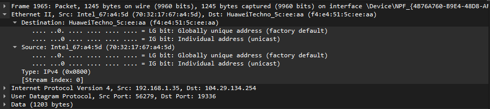
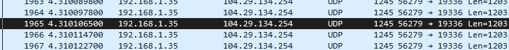
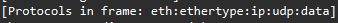
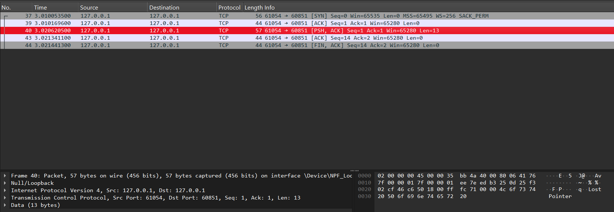
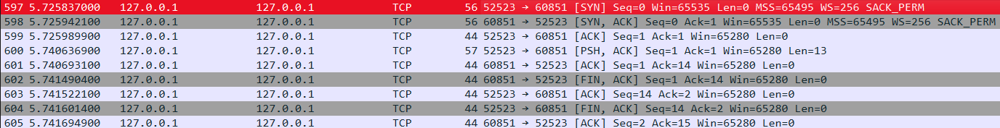
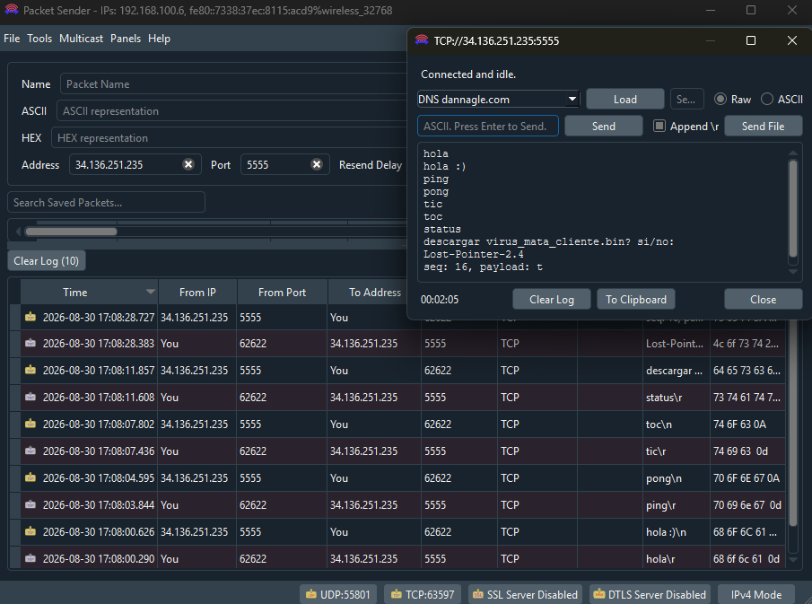
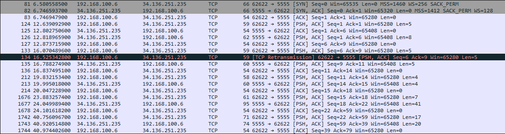

# Laboratorio 3 — Redes y Computadoras

**Universidad Nacional de Córdoba**
Facultad de Ciencias Exactas, Físicas y Naturales

**Grupo:** Lost Pointer

**Alumnos:**
- Catini Mariano
- Provensale Lorenzo
- Vallenari Tizziano
- Bogni Luciano
- Caldera Pedro
- Macagno Santiago

---

## 1)

### a)

La capa de enlace permite transferir datos mediante tramas entre dispositivos de un mismo enlace o red local. Esta se encarga del direccionamiento físico, del acceso y de la detección de errores.

**El IEEE divide la capa de enlace en dos subcapas:**

La LLC la cual es Logical Link Control, esta se encarga del control lógico del enlace y sirve como interfaz con las capas superiores.

Y luego tenemos la MAC la cual es Media Access Control. Esta misma se encarga principalmente de controlar el acceso al medio, utilizar las direcciones MAC y construir y transmitir las tramas. Una dirección MAC identifica una interfaz de red, un ejemplo puede ser 00:1A:2B:3C:4D:5E.

### b)

Una dirección MAC identifica una interfaz de Red dentro de una red local y permite entregar tramas. En cambio la direccion Ip lo que hace es identificar una interfaz dentro de una red IP y permite encaminar paquetes entre distintas redes.

### c)

El Ethernet aparece en la capa de acceso. La trama de Ethernet es la unidad de datos que transmite el Ethernet, la misma contiene la información necesaria para entregar y detectar errores.

La trama Ethernet tiene 6 campos:

| Campo | Función |
|---|---|
| Preámbulo y delimitador de inicio | Sincronizan al receptor e indican el comienzo de la trama. |
| MAC destino | Identifica a quién se entrega la trama. |
| MAC origen | Identifica quién la envía. |
| Tipo/Longitud | Indica el protocolo transportado o la longitud, según el formato. |
| Datos y relleno | Contienen la información transportada; el relleno permite alcanzar el tamaño mínimo. |
| FCS (CRC) | Permite detectar errores de transmisión. |

### d)

En **Ethernet II**, mediante el campo **EtherType**:

```
0x0800 → IPv4
0x86DD → IPv6
0x0806 → ARP
```

Con esos valores que se encuentran en el campo EtherType podemos saber que tipo de paquete debe interpretar el receptor, por ejemplo si llega 0x0800, sabemos que es un Paquete ipv4

---

## 2)

### a)



Aca estan las direcciones MAC de origen y destino, siendo la de origen (70:32:17:67:a4:5d) y la de destino (f4:e4:51:5c:ee:aa). La dirección MAC de origen corresponde a mi computadora (con procesador Intel) y la dirección MAC de destino corresponde a mi router (marca Huawei).

### b)



La dirección IP de origen es 192.168.1.35 y la direccion IP de destino es 104.29.134.254

### c)

No, no representan lo mismo. La dirección MAC representa a cada dispositivo individual que está conectado a una red. En cambio, la dirección IP representa la posición de dicho dispositivo en una red. La dirección MAC es siempre la misma en un dispositivo, en cambio, si ese mismo dispositivo se conecta a varias redes, va a tener una dirección IP diferente en cada una.

### d)



En el EtherType, el protocolo encapsulado es UDP

---

## 3)

### a)

Ethernet e IP tienen el problema de que no pueden garantizar la entrega confiada, ordenada y sin errores de datos entre aplicaciones.

Ethernet solo puede mover datos entre 2 dispositivos conectados a la misma red local física. IP envía paquetes a través de diferentes redes usando direcciones IP pero no avisa si se pierde, llega duplicado o llega en desorden.

En cambio, TCP detecta si un paquete no llega y pide una retransmisión. También asigna números de secuencia a los segmentos para poder rearmar la información antes de entregarla al destino.

TCP también puede controlar el flujo de paquetes para que un emisor muy rápido no sature a un receptor muy lento y puede reducir la velocidad de envío si nota que los enrutadores están saturados.

### b)

Los campos más importantes de la metadata de un TCP son los que gestionan el direccionamiento, la confiabilidad, el control y el estado de la conexión son:

- El puerto de origen y destino que identifican los procesos o aplicaciones finales de ambas máquinas estos juntos con la dirección IP forman el socket
- Número de secuencia que marca la posición del primer byte en el segmento
- El data offset que indica el tamaño del encabezado TCP indicando donde comienzan los datos y después las control flags
- SYN inicio de handshake
- ACK confirmación de la recepción
- FIN inicia el cierre de la conexión
- RST PSH URH son otras flags menos importantes
- Checksum que verifica la integridad del encabezado y de los datos mediante detección de errores

### c)

El Three y Four Way Handshake son los procesos que usa el TCP para iniciar y terminar una conexión de forma segura y ordenada entre 2 dispositivos.

**Three Way Handshake:**

Sucede antes de que el cliente y servidor envíen datos reales. Se usa para que ambos lados sincronizen sus números de secuencia y confirmen que están listos para enviar/recibir información.

- Paso 1: El cliente envía un paquete con la bandera SYN al servidor que incluye un número de secuencia inicial aleatorio.
- Paso 2: El servidor recibe el paquete y envía otro paquete que contiene las banderas SYN y ACK de vuelta al cliente. Confirmando el número del cliente y enviando su propio número de secuencia inicial.
- Paso 3: El cliente recibe el paquete antes mencionado y envía otro paquete con la bandera ACK para confirmar el número de secuencia del servidor. Quedando así establecida la conexión y dejando todo listo para enviar/recibir información.

**Four Way Handshake:**

Como la TCP es full-duplex, cada lado debe cerrar su propio canal por separado siguiendo estos pasos:

- Paso 1: El cliente envía un paquete con la bandera FIN
- Paso 2: El servidor recibe el paquete con la bandera FIN y envía un paquete con la bandera ACK para confirmar que recibió el primer paquete. A partir de este momento el cliente ya no puede enviar más datos pero el servidor sí puede.
- Paso 3: Cuando el servidor termina de enviar sus propios datos envía un paquete FIN para avisar que también cierra su lado de la conexión.
- Paso 4: El cliente recibe el paquete con la bandera FIN y envía un paquete con una bandera ACK para confirmar la finalización de la conexión. Borrando totalmente la conexión de la memoria de ambos equipos.

### d)



Aca se ve todo el proceso de Handshake en las trazas que contienen la flag SYN y ACK y en la traza que contiene la flag PSH se ve la carga útil del paquete "Lost Pointer".

### e)



Aca se ve todo el proceso del 3 Way Handshake y el proceso del 4 Way Handshake, junto al envío de la carga útil en la traza con la bandera de PSH.

### f)

El hecho de que sea tan fácil ver un paquete que viaja a través de la red demuestra que el tráfico base viaja a la vista de cualquiera. Ya sea en una red local o en algún punto intermedio, cualquier persona con un analizador de paquetes podría leer contraseñas o datos bancarios sin ningún tipo de restricción. Por esto es fundamental utilizar capas de cifrado encima como TLS/SSL, para que si alguien intercepta los paquetes, solo vea datos irreconocibles.

---

## 4) Interacción con el servidor:



Captura de la conexión usando WireShark:


