**UNIVERSIDAD NACIONAL DE CÓRDOBA**

**FACULTAD DE CIENCIAS EXACTAS, FÍSICAS Y NATURALES**

REDES Y COMPUTADORAS

**Trabajo Práctico N.º 4**

**Grupo: Lost Pointer**

**Integrantes**

Catini, Mariano

Provensale, Lorenzo

Vallenari, Tizziano

Bogni, Luciano

Caldera, Pedro

Macagno, Santiago

# Índice

Índice

Consignas

> 1) Alcance de redes y virtualización
>
> 2) Topología en Packet Tracer
>
> 3) Red LAN a bordo de una aeronave
>
> Ayuda: simulación del servidor de entretenimiento

Resolución

> 1) Alcance de redes y virtualización
>
> 2) Configuración de switches y VLAN
>
> a) Configuración inicial de los switches
>
> b) Contraseñas privilegiadas, de consola y vty
>
> c) Encriptación de contraseñas
>
> c y d) Configuración de VLAN en las interfaces
>
> g) Prueba de conectividad (ping) entre las computadoras
>
> h e i) Creación de VLANs y verificación (show vlan brief)
>
> j, k, l) Asignación de PC-A a la VLAN Laboratorio y VLAN de Management
>
> m) Asignación de PC-B a la VLAN Laboratorio en sw2
>
> n) Verificación de conectividad final (PC-A, PC-B, sw1, sw2)
>
> 3) Red LAN a bordo de una aeronave

# Consignas

## 1) Alcance de redes y virtualización

> **a)** Investigar cómo se clasifican las redes según su alcance. Mencionar brevemente las características principales de cada una y colocar en cada cuadro de la figura el acrónimo de red que corresponda.
>
> **b)** ¿Qué es una VLAN? ¿Cómo se clasifican?
>
> **c)** Investigar y resumir el protocolo IEEE 802.1Q. ¿Cómo se relaciona con las VLAN?
>
> **d)** En el contexto de los dos ítems anteriores, ¿qué es el Tagging?

## 2) Topología en Packet Tracer

Implementaremos la siguiente topología en Packet Tracer:

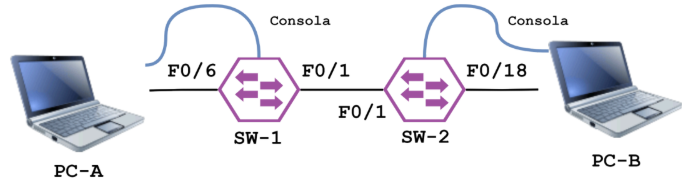

*Figura 1. Topología de red a implementar*

Con la siguiente tabla de ruteo:

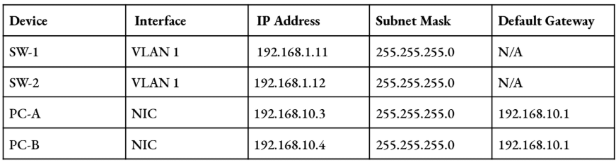

*Figura 2. Tabla de ruteo*

> **a)** Desde cada computadora, ingresar a la terminal y configurar los switch. Nombrar a los mismos sw1 y sw2 respectivamente. Ayuda: investigar los comandos necesarios online si no te acordás, por ejemplo, para cambiar el nombre del switch:

```
switch>
switch>en
switch#conf t
switch(config)#hostname nombre
```

> **b)** Asignar contraseñas privilegiadas, de consola y vty. Ayuda:

```
enable secret contrasena_exec
line console 0
password contrasena_consola
login
exit
line vty 0 15
password contrasena_vty
login
exit
```

> **c)** Encriptar las contraseñas (ayuda: utilizar service password-encryption).
>
> **d)** Configurar las redes VLAN para ambos switch según la tabla de direcciones provista. Ayuda:

```
interface vlan 1
ip address <IP_address> <subnet_mask>
no shutdown
exit
```

> **e)** Desconectar todas las interfaces que no estén siendo utilizadas (ayuda: podés ver las interfaces utilizando show ip interface brief.)
>
> **f)** Guardar la configuración (write memory).
>
> **g)** Testear comunicación usando pings entre las computadoras.
>
> **h)** Crear VLANs en ambos switches. Ayuda:

```
sw1(config)# vlan 10
sw1(config-vlan)# name Laboratorio
sw1(config-vlan)# vlan 20
sw1(config-vlan)# name Bar
sw1(config-vlan)# vlan 99
sw1(config-vlan)# name Management
sw1(config-vlan)# end
```

> **i)** Utilizar show vlan brief para visualizar la lista de VLANs en alguno de los switch. ¿Cuál es la VLAN utilizada por defecto? Colocar el output en el informe.
>
> **j)** Asignar la PC-A a la VLAN Laboratorio. Ayuda:

```
sw1(config)# interface f0/6
sw1(config-if)# switchport mode access
sw1(config-if)# switchport access vlan 10
```

> **k)** Desde la VLAN 1, remover la IP de Management y configurarla para funcionar en la VLAN 99 (que configuramos como Management). Ayuda:

```
sw1(config)# interface vlan 1
sw1(config-if)# no ip address
sw1(config-if)# interface vlan 99
sw1(config-if)# ip address IP MASCARA
sw1(config-if)# end
```

> **l)** Verificar el estado de la VLAN utilizando show vlan brief y el estado de las interfaces utilizando show ip interface brief. Colocar los output en el informe e interpretar.
>
> **m)** Asignar la PC-B a la VLAN Laboratorio en el sw2. Repetir el inciso k) pero para el sw2.
>
> **n)** Verificar la conectividad entre PC-A y PC-B utilizando pings. Verificar conectividad entre sw1 y sw2 utilizando pings. Interpretar los resultados.

*Si necesitás más ayuda podés consultar el ejercicio de Cisco correspondiente. Cuidado al aplicar los comandos: siempre hay que estar seguro de estar ubicado en el directorio/programa que corresponda. Cuidado al copiar componentes, ya que se copian también las configuraciones (passwords, usuarios, VLANs, etc.).*

## 3) Red LAN a bordo de una aeronave

Utilizando lo que aprendimos sobre VLAN, e investigando la configuración de NAT y ACLs, simularemos el despliegue de una red LAN a bordo de una aeronave. La idea es la siguiente: tendremos tres segmentos.

> • Clase Turista: acceso solo a un sistema de entretenimiento (server local).
>
> • Clase Business: acceso a sistema de entretenimiento e internet.
>
> • Administración: acceso total.

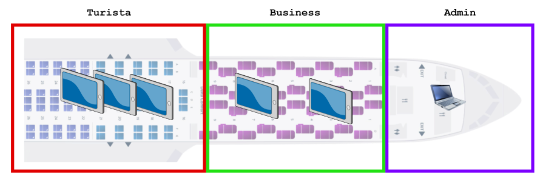

*Figura 3. Segmentos de la red de la aeronave*

Podés usar una topología de red como la siguiente:

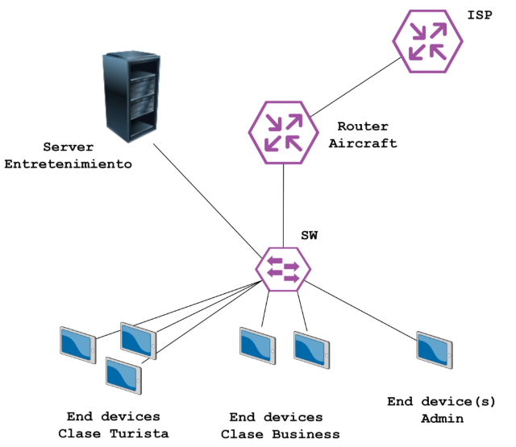

*Figura 4. Topología de red sugerida*

Y la siguiente tabla de direccionamiento:

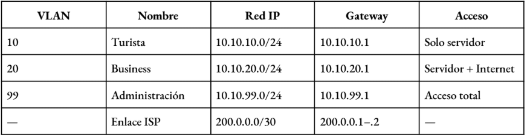

*Figura 5. Tabla de direccionamiento*

Luego de configurar la red realizarán las siguientes pruebas:

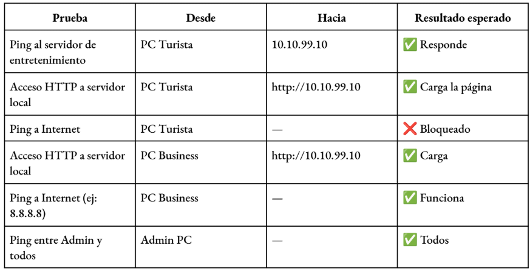

*Figura 6. Pruebas a realizar*

Por supuesto, pueden simular "internet" con cualquier cosa que responda del lado del ISP.

Detallar en el informe el diagrama de red (hecho en Packet Tracer), capturas de pantalla y conclusiones.

### Ayuda: simulación del servidor de entretenimiento

Para simular el servidor de entretenimiento pueden utilizar el mismo servicio HTTP que ya viene por defecto con los servidores de Packet Tracer. Pueden modificar o agregar un documento .html a su gusto a los efectos de simular el servicio:

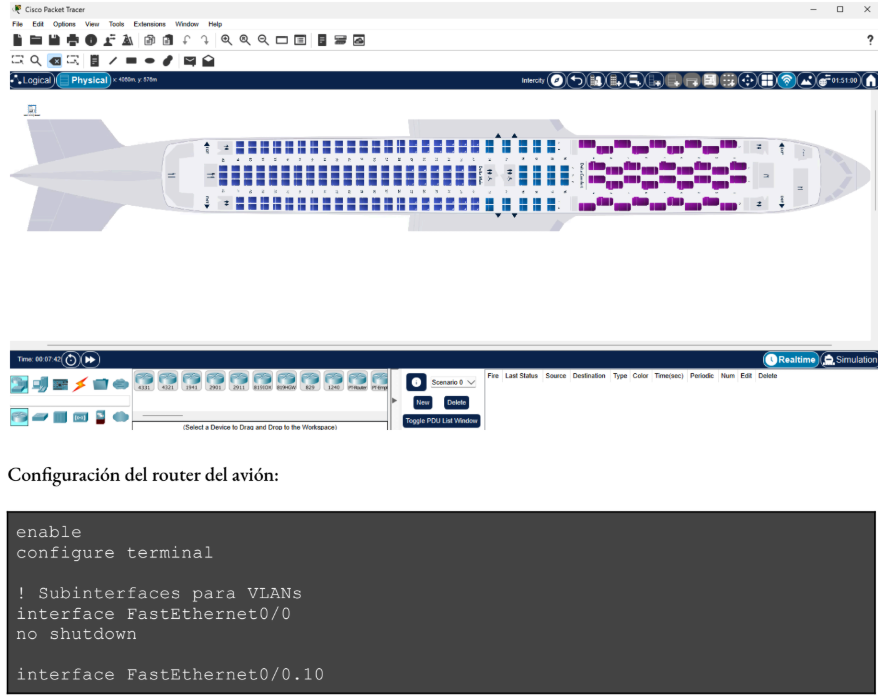

*Figura 7. Configuración del servicio HTTP*

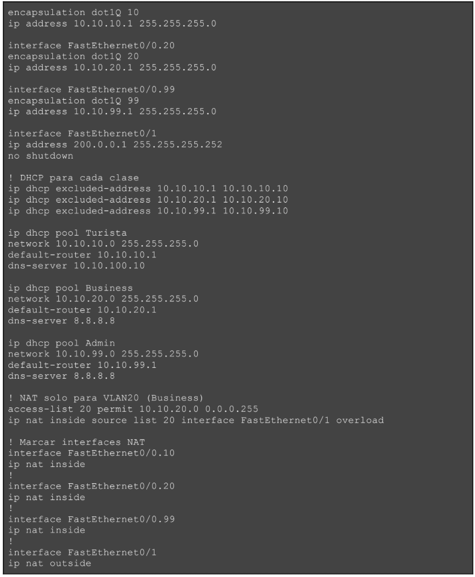

*Figura 8. Documento HTML de ejemplo*

# Resolución

## 1) Alcance de redes y virtualización

**a)** Las redes se pueden clasificar según su alcance:

- **PAN:** red personal, de pocos metros. Ejemplo: Bluetooth.

- **LAN:** red local, como la de una casa, oficina o facultad.

- **MAN:** cubre una ciudad o zona metropolitana.

- **WAN:** cubre grandes distancias, como países o continentes.

- **GAN:** tiene alcance global.

**b)** Una **VLAN** es una red virtual que permite dividir una red física en varias redes lógicas independientes. Se pueden clasificar, por ejemplo, según puertos, direcciones MAC, protocolos o direcciones IP.

**c)** El **IEEE 802.1Q** es un estándar que permite identificar a qué VLAN pertenece una trama Ethernet. Para eso agrega una etiqueta a la trama. Se utiliza principalmente en enlaces **trunk**, donde viajan datos de varias VLAN.

**d)** El **Tagging** es el proceso de agregar esa etiqueta 802.1Q a una trama para indicar a qué VLAN pertenece. De esta forma, los switches pueden identificar y separar correctamente el tráfico de cada VLAN.

## 2) Configuración de switches y VLAN

### a) Configuración inicial de los switches

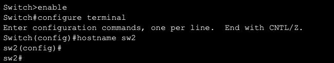

### b) Contraseñas privilegiadas, de consola y vty

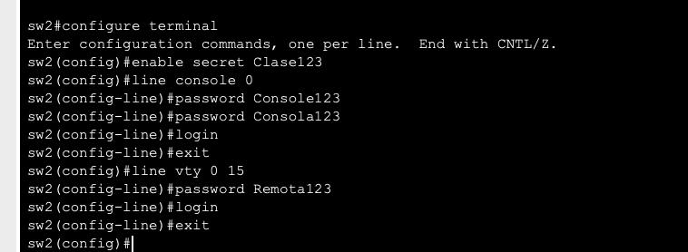

### c) Encriptación de contraseñas

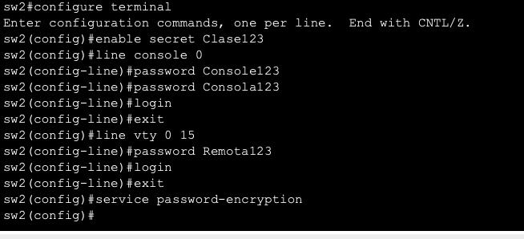

### c y d) Configuración de VLAN en las interfaces

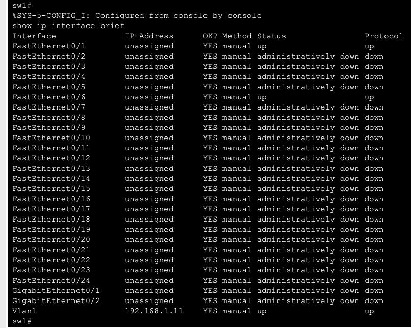

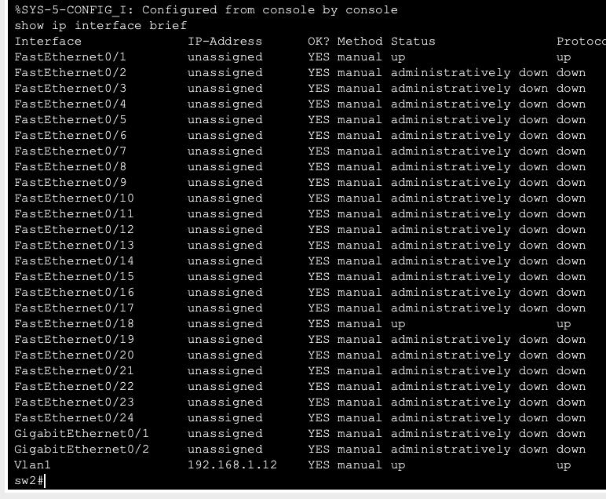

### g) Prueba de conectividad (ping) entre las computadoras

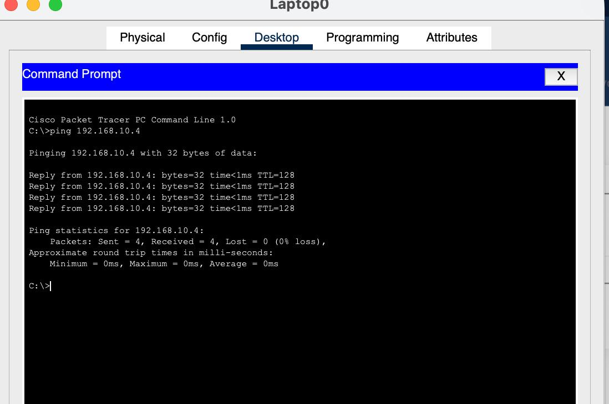

### h e i) Creación de VLANs y verificación (show vlan brief)

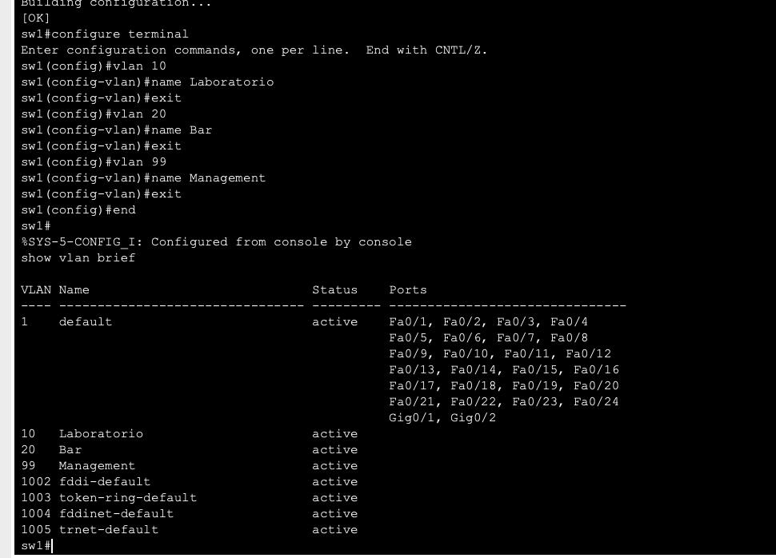

### j, k, l) Asignación de PC-A a la VLAN Laboratorio y VLAN de Management

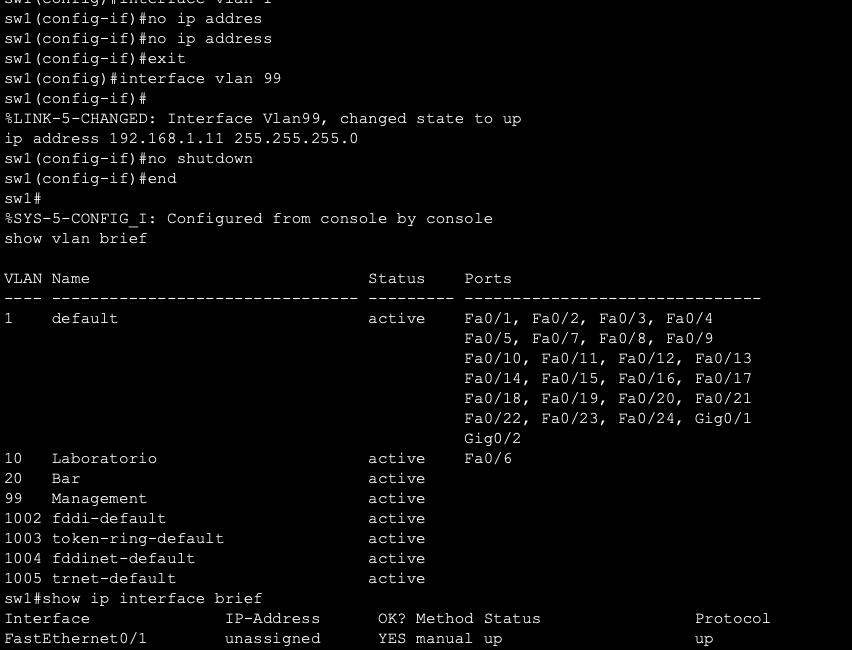

### m) Asignación de PC-B a la VLAN Laboratorio en sw2

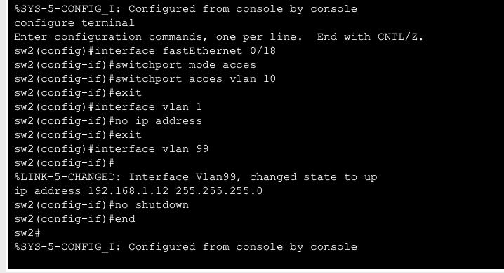

### n) Verificación de conectividad final (PC-A, PC-B, sw1, sw2)

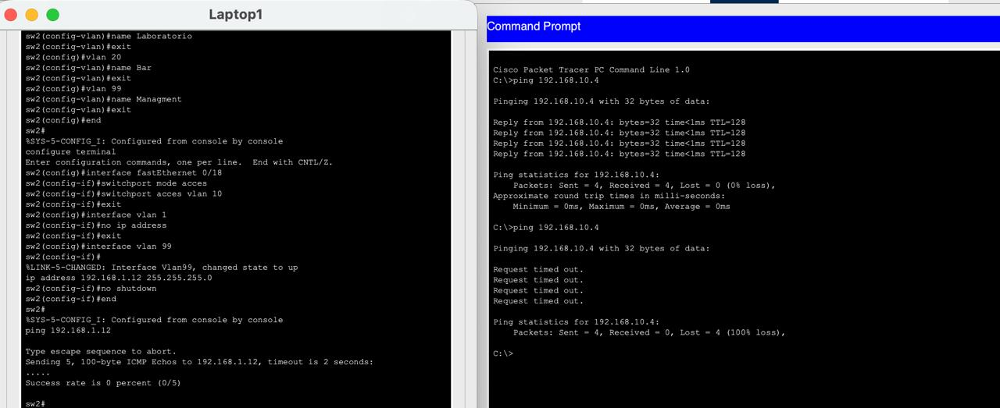

## 3) Red LAN a bordo de una aeronave

Implementamos una red LAN para un avión segmentada en tres VLAN, los 3 segmentos comparten la misma infraestructura física y se separan lógicamente mediante vlans

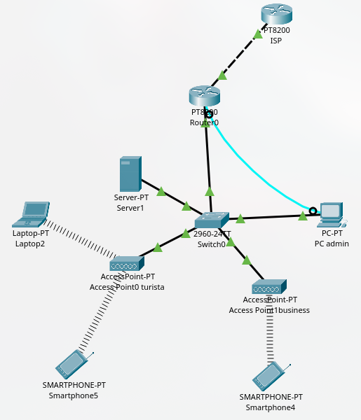

### 3. Verificación y Pruebas de Funcionamiento de la Red

Para demostrar el correcto funcionamiento de la topología configurada, se realizaron pruebas de conectividad inter-VLAN, acceso a la red externa y comprobación de servicios en la capa de aplicación.

**Tabla de direccionamiento**

| **VLAN** | **Nombre**     | **Red**       | **Gateway** | **Acceso**               |
|----------|----------------|---------------|-------------|--------------------------|
| 10       | Turista        | 10.10.10.0/24 | 10.10.10.1  | Servidor entretenimiento |
| 20       | Business       | 10.10.20.0/24 | 10.10.20.1  | Servidor + Internet      |
| 99       | Administración | 10.10.99.0/24 | 10.10.99.1  | Acceso total             |

El servidor de entretenimiento utiliza ip estática

#### Asignación de puertos del switch

| **Puerto**                 | **Dispositivo**             | **Modo / VLAN** |
|----------------------------|-----------------------------|-----------------|
| Fa0/1                      | Servidor de entretenimiento | access - 99     |
| Fa0/2                      | Router                      | trunk           |
| Fa0/8                      | Access Point Turista        | access - 10     |
| Fa0/11                     | Access Point Business       | access - 20     |
| Fa0/6                      | PC Administración           | access - 99     |
| Fa0/12 en adelante sin uso | —                           | shutdown        |

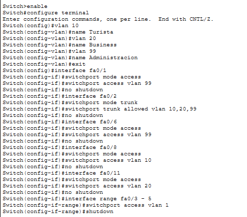

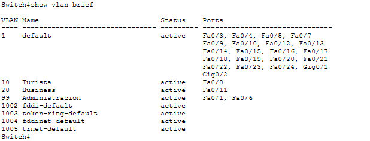

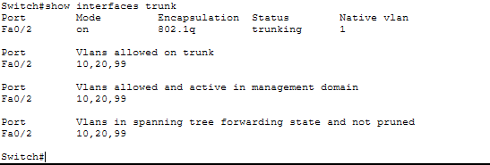

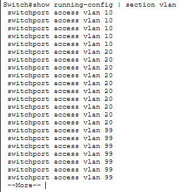

El servicio se implementó sobre el servidor HTTP integrado de Packet Tracer, con dirección estática dentro de la VLAN de Administración que este en la vlan de administración no quiere decir que turista pueda acceder sino que el router hace el ruteo inter VLAN y después la acl decide si pasa o no.

El router funciona como servidor DHCP para los tres segmentos. Al recibir un mensaje DHCP Discover, selecciona el pool cuya red coincide con la dirección de la subinterfaz por la que ingresó el paquete, de modo que cada dispositivo recibe automáticamente una dirección de la VLAN a la que pertenece su puerto. Los pools de Business y Administración entregan un DNS externo, mientras que el de Turista apunta al servidor local.

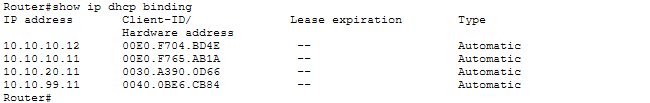

Aplicamos una lista de control de acceso extendida en sentido entrante sobre la subinterfaz de Clase Turista, de modo que el filtrado se realiza en el primer salto, antes del proceso de enrutamiento. La lista permite explícitamente el tráfico DHCP, el acceso al servidor de entretenimiento y las respuestas ICMP hacia el segmento de Administración, y descarta todo el resto.

Dado que los tres segmentos utilizan direccionamiento privado, se configuró NAT sobre la interfaz de salida, traduciendo el tráfico de Business y Administración a la dirección pública del enlace WAN. La red de Clase Turista se excluyó deliberadamente de la lista de traducción, de modo que aun en ausencia de la ACL no podría establecer comunicación con Internet.

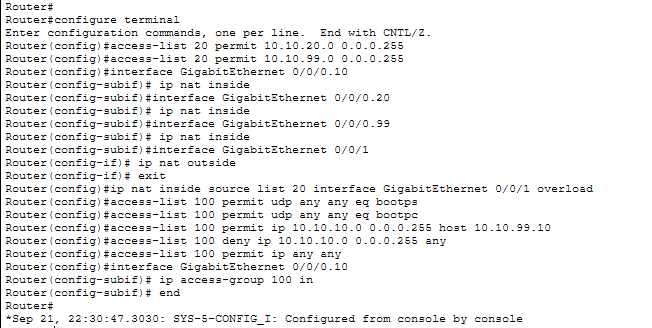

#### 3.1. Verificación del Enrutamiento Inter-VLAN y Salida a Internet

Se ejecutaron pruebas de conectividad mediante el comando ping desde el host **PC1** hacia los distintos segmentos de la red local (VLANs de gestión, usuarios y servidores) y hacia la dirección pública de Internet (8.8.8.8).

Para simular la red externa se utilizó un segundo router conectado mediante un enlace punto a punto /30. La dirección 8.8.8.8 se configuró como interfaz de loopback, actuando como destino de prueba en Internet.

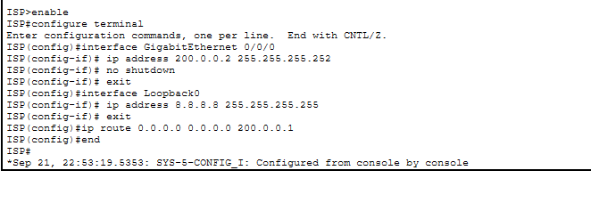

- **Resultado:** Se obtuvo un **100% de éxito** en el tráfico interno y un **75% de éxito inicial** hacia la WAN. La pérdida del primer paquete en el intento inicial es un comportamiento esperado debido al proceso de resolución de direcciones del protocolo ARP.

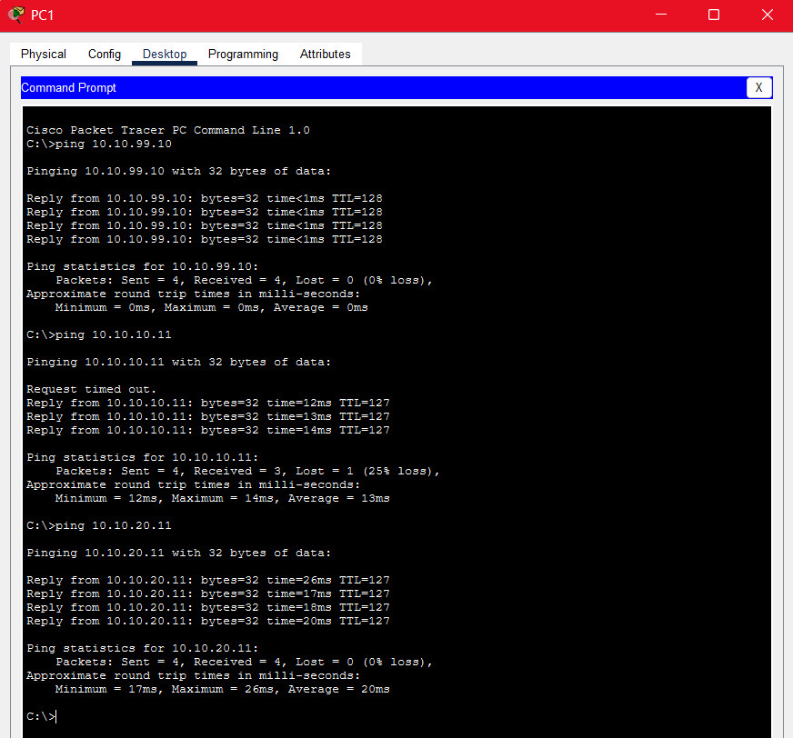

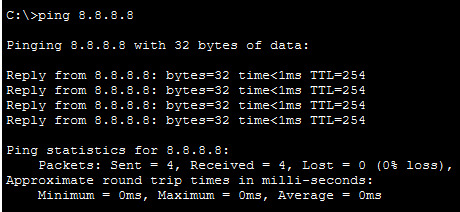

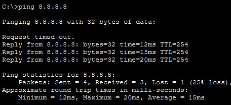

#### 3.2. Estado de Interfaces y Subinterfaces en el Router (Router0)

Se verificó el estado operacional del router principal mediante el comando show ip interface brief. Se comprueba la correcta implementación de la técnica **Router-on-a-Stick** sobre la interfaz física GigabitEthernet0/0 mediante sus respectivas sub interfaces asociadas a cada VLAN (.10, .20 y .99), así como el enlace de salida a la WAN en GigabitEthernet0/1 con la dirección IP 200.0.0.1.

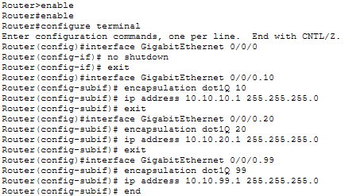

- **Resultado:** Todas las subinterfaces del esquema inter-VLAN y la interfaz de salida externa se encuentran en estado físico y lógico **up/up**.

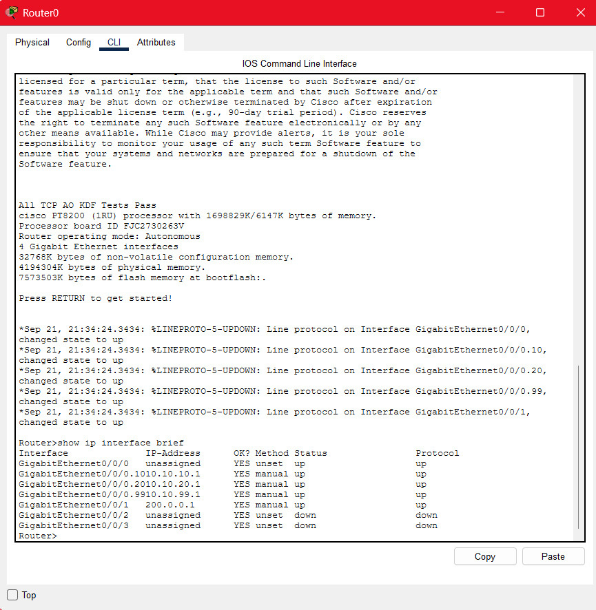

#### 3.3. Comprobación del Servicio Web (Capa de Aplicación)

Se probó el acceso al servidor HTTP localizado en la red local (10.10.99.10) desde un dispositivo inalámbrico (**Smartphone**) conectado a la red Wi-Fi de cabina

- **Resultado:** El navegador web cargó exitosamente el portal del *"Sistema de Entretenimiento a Bordo"*, confirmando el correcto transporte de paquetes de Capa 7 (HTTP/TCP) a través de los enlaces de conmutación e inalámbricos.

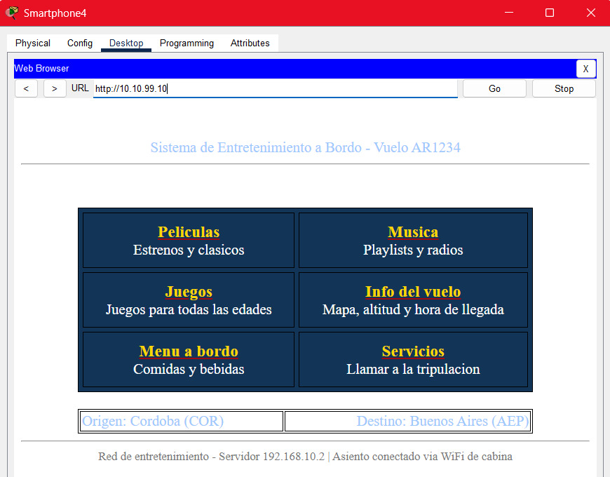
