**UNIVERSIDAD NACIONAL DE CÓRDOBA**

**FACULTAD DE CIENCIAS EXACTAS, FÍSICAS Y NATURALES**

REDES Y COMPUTADORAS

**Laboratorio N.º 5**

**Grupo: Lost Pointer 2.4**

**Integrantes**

Catini, Mariano

Provensale, Lorenzo

Vallenari, Tizziano

Bogni, Luciano

Caldera, Pedro

Macagno, Santiago

# Índice

1) ICMP y primer contacto con Wireshark

2) ARP: de una IP a una dirección MAC

3) TCP y UDP "a mano" con ncat

4) Servidor TCP mínimo

# Resolución

## 1) ICMP y primer contacto con Wireshark

Empezamos con la herramienta de red más conocida: ping. La vamos a usar como "generador de tráfico" para aprender a leer una captura. Investigar brevemente y documentar en el trabajo:

> **a)** ¿Qué es ICMP y para qué se usa? ¿Transporta datos de aplicaciones como lo hacen TCP o UDP?

Es el protocolo de mensaje de control de internet. Brinda información de realimentación sobre problemas del entorno de la comunicación. No transporta datos de aplicaciones como TCP o UDP, lo generan y consumen los propios módulos IP de hosts y routers.

> **b)** ¿Qué relación tiene con IP? ¿Viaja dentro de IP, al lado de IP o debajo de IP? ¿Cómo sabe el receptor que el contenido de un paquete IP es ICMP?

Viaja dentro del IP, aunque ICMP está en el mismo nivel que IP, es un usuario IP. El receptor sabe que es ICMP por el campo protocolo del IPv4.

> **c)** ¿Qué hace ping? ¿Qué son un Echo Request y un Echo Reply? ¿Qué campos de ICMP permiten distinguirlos?

Un ping sirve para comprobar si un equipo es alcanzable en la red. Lo que hace es enviar un Echo Request y espera el Echo Reply. Lo que nos permite medir el tiempo de ida y vuelta y la pérdida de paquetes. En ICMP para IPv4 se distinguen por el campo Tipo: 8 para la solicitud y 0 para la respuesta. En ambos casos, el campo Código vale 0.

> **d)** ¿Qué información mínima contiene un mensaje ICMP de tipo Echo?

Todos los mensajes ICMP comienzan con 4 bytes comunes, a los que Echo le agrega 4 más. Por lo tanto, mínimamente tiene 8 bytes (Type, Code, Checksum, Identifier y Sequence Number).

### Configuración de red y capturas

Averiguamos la configuración de red de una de las computadoras del grupo: dirección IPv4, máscara, gateway por defecto y dirección MAC de la interfaz.

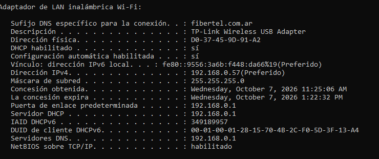

Todos los mensajes ICMP, luego de usar -4 y direcciones IP para forzar IPv4.

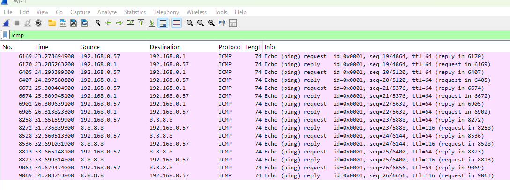

Solo Echo Request

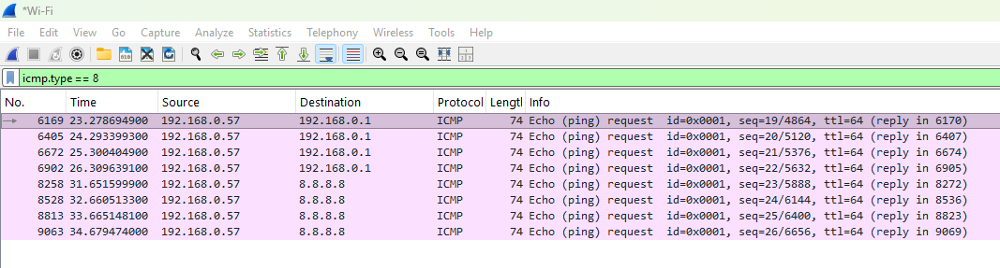

Solo Echo Reply

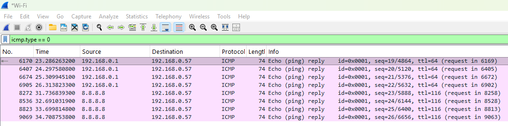

El intercambio con esa IP (en ambos sentidos)

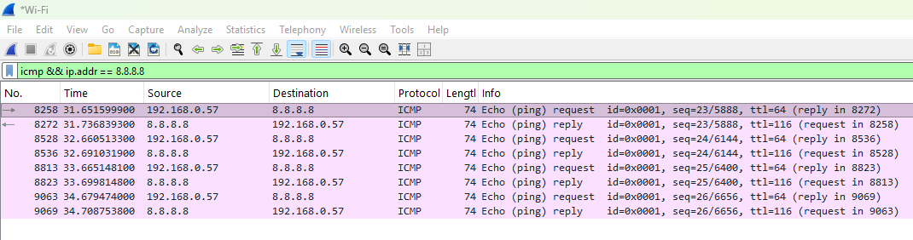

Seleccionamos un Echo Request y desplegamos el panel de detalles:

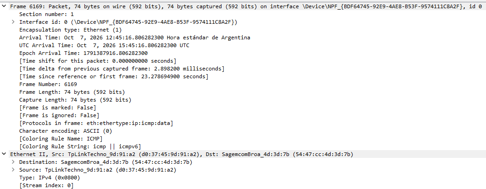

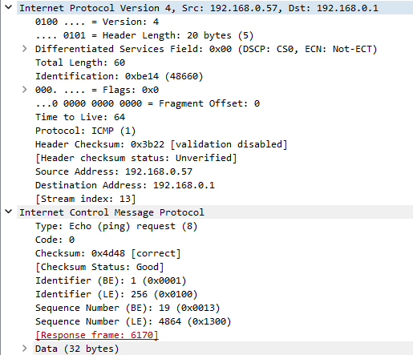

| Capa | Dirección origen | Dirección destino | ¿Qué campo indica qué protocolo viene "adentro"? |
|------|------------------|-------------------|--------------------------------------------------|
| Ethernet II | TpLinkTechno_9d:91:a2 (d0:37:45:9d:91:a2) | SagemcomBroa_4d:3d:7b (54:47:cc:4d:3d:7b) | Type: IPv4 (0x800) |
| Internet Protocol Version 4 | 192.168.0.57 | 192.168.0.1 | Protocol ICMP |
| Internet Control Message Protocol | No tiene (sin puertos) | No tiene | Type: Echo (ping) request (8) y Code: 0 |
| Datos / payload | No tiene | No tiene | No aplica, son 32 bytes de datos que el Reply devuelve idénticos |

*Internet Control Message Protocol se identifica con Identifier 1 (0x0001) y Sequence number 19*

### Análisis de la captura

> **a)** La MAC destino del Echo Request enviado a 8.8.8.8, ¿es la MAC de 8.8.8.8? ¿De qué equipo es? Compárenla con la MAC destino del ping al gateway. ¿Qué conclusión sacan sobre el alcance de una dirección MAC frente al de una dirección IP?

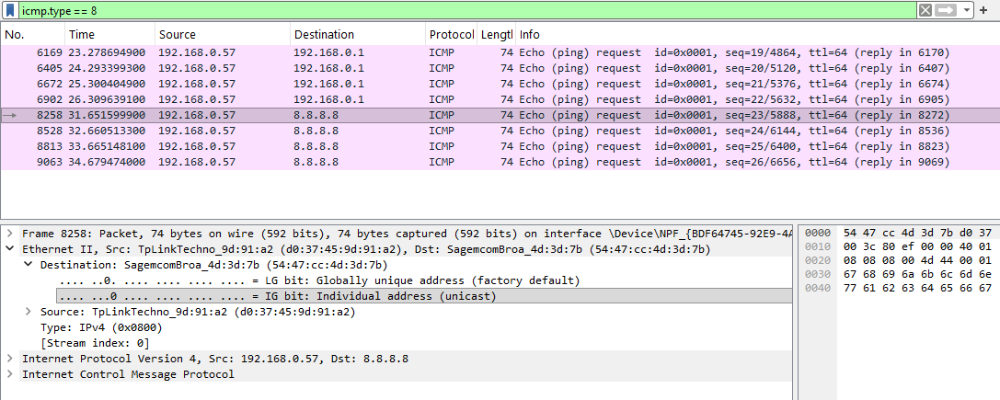

La MAC destino del Echo Request a 8.8.8.8 no es la del servidor de Google. Es 54:47:cc:4d:3d:7b que corresponde a nuestro router, lo que pasa es que 8.8.8.8 está fuera de nuestra red local. Vemos que la MAC destino es exactamente la misma en ambos casos a pesar de que la IP de destino cambia.

Por lo tanto, la dirección MAC solo sirve dentro de la red local, ya que no identifica el destino final. En cambio, la dirección IP viaja sin cambios e identifica el destino final del paquete.

> **b)** Comparen un Echo Request con su Echo Reply (Wireshark los vincula en el campo [Response frame: …]). Hagan una lista de los campos que cambian y de los que se mantienen en Ethernet, IP e ICMP. ¿Por qué tiene sentido cada cambio? ¿Por qué el identificador y el número de secuencia se mantienen?

Comparamos la Nº 6169 (Echo Request):

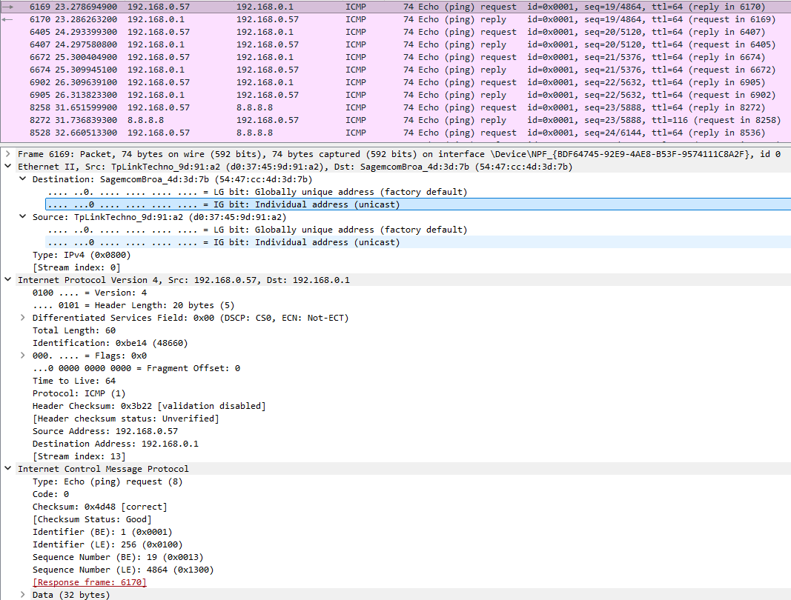

Con la Nº 6170 (Echo Reply):

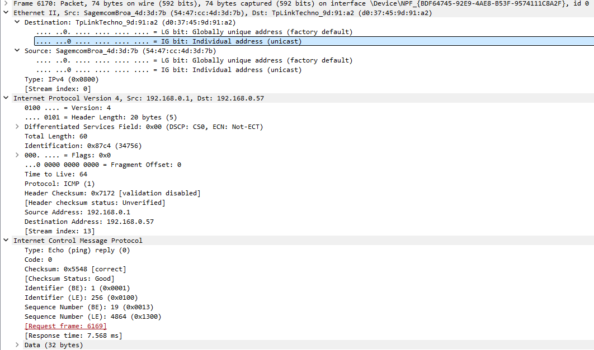

En la capa de Ethernet II, las direcciones de MAC origen y MAC destino se invierten. A su vez se mantiene Type: IPv4 (0x800). En la capa de IPv4 se invierten la IP de origen y de destino y cambian Identification y Header Checksum. Se mantienen TTL, Protocol, length, entre otros. Por último, en la capa de ICMP cambia de Type: Echo Request (8) a Echo Reply (0) y Checksum, y se mantiene Identifier (0x0001), Sequence Number (19), Data y Code.

> **c)** ¿Dónde está el payload de ping? ¿Cuántos bytes tiene y qué contiene? ¿Es igual en el Reply? Si en el grupo hay una computadora con Windows y otra con Linux, compárenlos: ¿qué les sugiere que sean distintos?

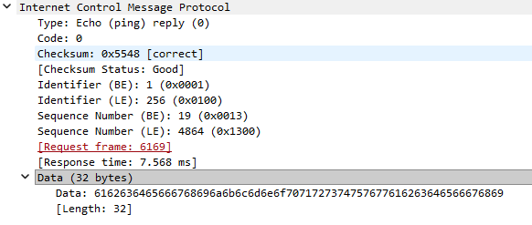

El payload se encuentra en la última línea del panel de detalles. Tiene 32 bytes y contiene cierta cantidad de letras para darle tamaño al paquete. Debe ser igual al Reply, ya que este tiene que devolver los mismos datos que recibió.

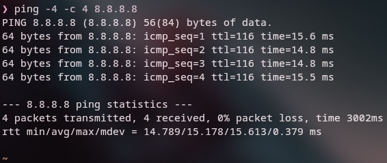

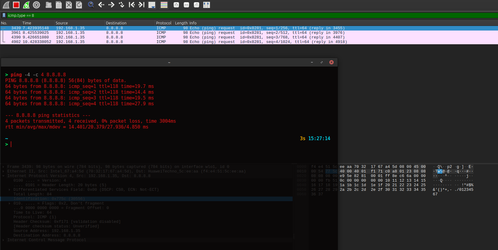

> **d)** ¿Qué valor de TTL tiene el Echo Request que ustedes enviaron? ¿Y el Reply que llegó de 8.8.8.8? ¿Por qué no son iguales? (Pista: investiguen qué hace un router con el TTL.)

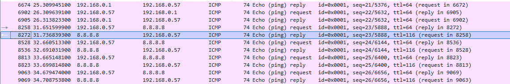

El Echo Request que enviamos tiene TTL 64, mientras que el Echo Reply (que llegó de 8.8.8.8) tiene TTL 116. No son iguales ya que cada equipo asigna su propio TTL inicial a los paquetes que genera: nuestra PC utilizó 64 y el servidor de Google tiende a usar 128. Además, cada router que reenvía un paquete le resta 1 al TTL, por lo tanto el reply atravesó 12 routers.

> **e)** Dibujen la encapsulación del paquete que eligieron como "cajas dentro de cajas", indicando para cada caja qué tamaño en bytes tiene según Wireshark.

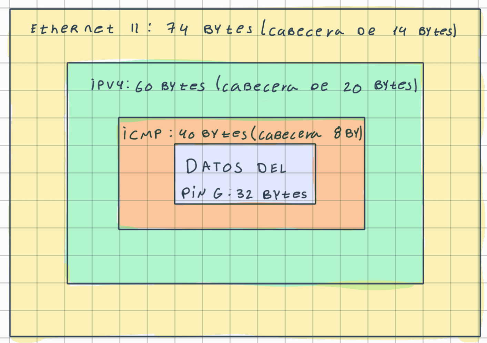

## 2) ARP: de una IP a una dirección MAC

En el punto anterior la trama Ethernet ya tenía una MAC destino. Pero ping solo conoce una IP. ¿De dónde salió esa MAC? Investigar brevemente:

> **a)** ¿Qué problema resuelve ARP? ¿En qué capa lo ubicarían y por qué es discutible?

Traduce una dirección IP de la red local a la dirección MAC que necesita la trama Ethernet. Hacen falta dos niveles de direccionamiento: la dirección IP identifica el conjunto de redes y la capa de acceso a la red necesita su propia dirección de subred para entregar la trama. Su capa es discutible ya que viaja directo sobre Ethernet, sin cabecera IP, pero el trabajo es servir a la capa 3 y maneja direcciones IP.

> **b)** ¿Qué es un ARP Request y un ARP Reply? ¿A quién se envía cada uno?

El ARP Request es un mensaje en el que el dispositivo le pregunta a la red quién tiene designada una dirección IP específica para conocer su dirección MAC. Se envía a un broadcast, o sea que le llega a todos los de la red LAN.

El ARP Reply es el mensaje emitido por el dispositivo que reconoce que la dirección IP solicitada le pertenece. Se envía de forma unicast únicamente al dispositivo que le hizo la pregunta.

> **c)** ¿Qué es la caché ARP y por qué existe?

Es una tabla de IP ↔ MAC con tiempo de vida que guarda cada equipo. Existe para no mandar un broadcast por cada paquete de datos.

> **d)** Traten de responder con sus palabras: "Tengo la IP de una máquina de mi red local. ¿Cómo sé a qué dirección MAC debo enviarle la trama?"

Miro la IP para ver si está en la subred, comparándola con mi IP y mi máscara. Si está, busco la MAC; si no la tengo, pregunto por broadcast quién tiene la IP. Si la IP está fuera de mi subred no busco su MAC, busco la del gateway y le mando la trama.

> **e)** Ver la caché ARP de su computadora y buscar la entrada del gateway. ¿La MAC asociada al gateway coincide con la MAC destino que vieron anteriormente?

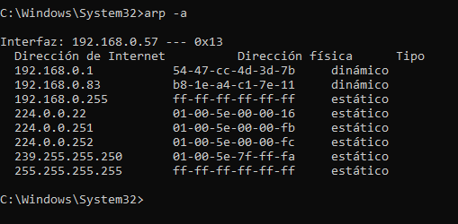

Sí, la MAC asociada al gateway (192.168.0.1) en la caché ARP coincide con la MAC destino que vimos anteriormente.

> **f)** Generar tráfico ARP y capturarlo. Capturen en la interfaz Wi-Fi/Ethernet con el filtro `arp`. Como las entradas quedan guardadas en la caché, un ping a un equipo con el que ya hablaron puede no generar ningún ARP. Tienen varias formas de provocarlo (elijan la que puedan usar).

Decidimos realizarlo haciendo ping a una IP de nuestra subred que no esté en uso.

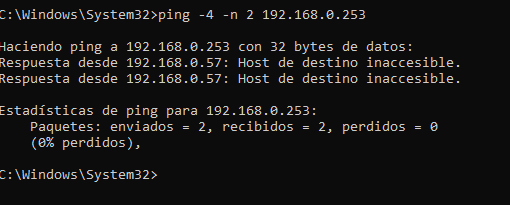

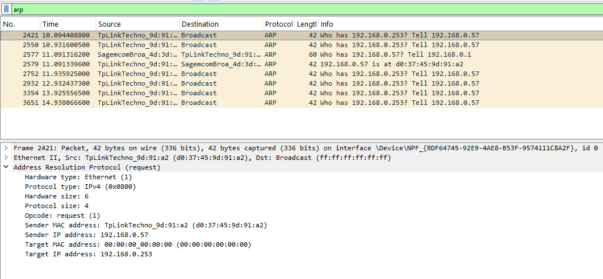

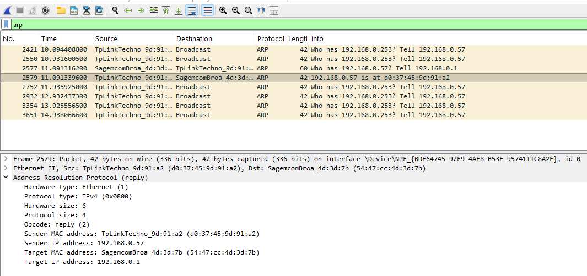

## 3) TCP y UDP "a mano" con ncat

Hasta ahora observamos protocolos que usa el sistema operativo. Ahora vamos a comunicar dos procesos (dos programas) sin escribir código todavía. ncat es un programa que toma lo que escribimos en el teclado y lo manda por la red (y viceversa). La idea es empezar a generar tráfico cada vez más a bajo nivel (primero generamos tráfico con Packet Tracer, luego con la terminal del SO, ahora con un software a través de la CLI y finalmente ejecutaremos algunos scripts).

Investigar brevemente:

> **a)** ¿Qué significa "establecer una conexión"? ¿Dónde "existe" una conexión TCP: en los cables, en los routers o en los extremos?

Es una asociación lógica de carácter temporal entre dos entidades. La conexión existe solo en los extremos, es el estado que guarda el SO de cada host. Los cables llevan bits y los routers envían paquetes IP sin saber de conexiones.

> **b)** ¿Qué es un puerto? ¿Qué identifica el par (IP, puerto)?

Cada proceso necesita una dirección que sea única dentro del mismo computador; a esas direcciones se las denomina puertos. El par (IP, puerto) identifica un extremo de comunicación en toda la red: un proceso concreto en un host concreto.

> **c)** ¿Qué significa que un proceso esté "escuchando" en un puerto?

Que un proceso esté "escuchando" significa que un programa o servidor creó un socket (2 pares (IP, puerto) que distinguen una comunicación entre 2 programas) que está vinculado a una IP y un puerto local, y le pide al SO que espere peticiones de conexión entrantes a ese puerto. Durante esta espera, el SO va a aceptar los paquetes de inicio de conexión SYN que lleguen a ese puerto sin rechazarlos.

### Comunicación TCP

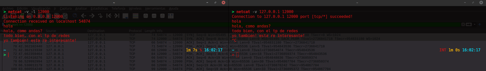

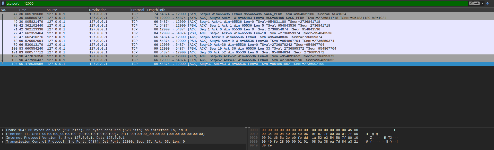

### Comunicación UDP

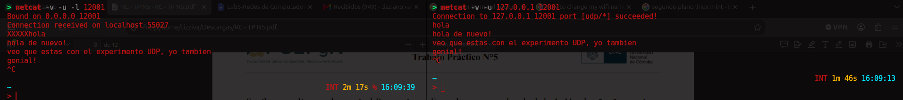

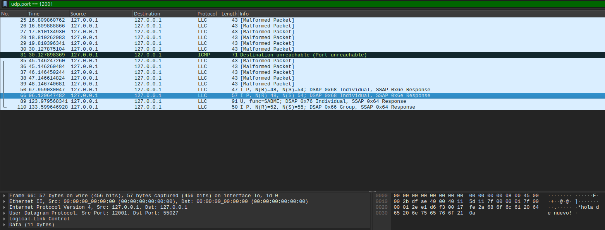

> **a)** ¿Qué pasó en la red cuando ejecutaron el comando del cliente, antes de escribir el primer mensaje? Compárenlo con TCP.

Mirando la red en Wireshark durante la comunicación UDP se observa directamente el envío del mensaje por parte del cliente. En la red no ocurre nada al momento de establecer la conexión, ya que no existe ningún tipo de verificación de conexión previa, y de inmediato se observa la respuesta del servidor. Haciendo pruebas notamos que si el servidor es el primero en enviar un mensaje, el cliente no recibe nada, ya que la comunicación no se habilita hasta que el cliente envíe algo primero.

Por otro lado, en TCP la conexión se establece desde un inicio con ambas partes teniendo conocimiento de la otra. En ese instante, en la red se observa el three-way handshake con sus respectivos paquetes ACK. Gracias a la negociación previa propia del protocolo, si el servidor envía un mensaje primero, el cliente sí lo recibe correctamente.

> **b)** ¿Cuántos datagramas generó cada mensaje? ¿Hay algo parecido a un ACK?

Cada mensaje genera un solo datagrama y nada se parece al ACK, porque el emisor no recibe ninguna confirmación: si el servidor responde, es solo un mensaje, no se confirma nada. En cambio, en TCP todos tienen que recibir su ACK.

> **c)** Comparen el encabezado UDP con el encabezado TCP de un segmento con datos: ¿qué campos tiene cada uno? ¿Cuántos bytes ocupa cada encabezado?

Los campos en UDP son: puerto de origen y destino, longitud y checksum, con un tamaño de 8 bytes.

En TCP tenemos puerto de origen y destino, número de secuencia, número de ACK, header length, flags, ventana, checksum, urgent pointer y opciones, con una longitud de mínimo 20 bytes.

> **d)** ¿Qué pasó en la red al cerrar el cliente con Ctrl+C? ¿Y en TCP?

En UDP, el cierre de un cliente no significaba el cierre del otro. Ambos tienen que cerrar por separado. En cambio, en TCP, el cierre de uno de los clientes instantáneamente cierra al otro, por lo que solo hay que cerrar una vez.

> **e)** Para enviar la misma frase, ¿cuántos paquetes necesitaron en total con TCP y cuántos con UDP? ¿Qué "compran" con los paquetes extra de TCP?

UDP envía muchos menos paquetes que TCP para intercambiar la misma cantidad de información. En nuestro caso, UDP usa un solo paquete para enviar un "hola", en cambio, TCP usa 2 paquetes.

Esto se debe a que TCP se asegura de que la información llegue al destinatario, a diferencia de UDP que solo envía y no revisa nada.

> **f)** ¿Y si nadie escucha? Con Wireshark capturando en loopback y el filtro `tcp.port == 12000 || udp.port == 12001 || icmp`, sin servidores corriendo:

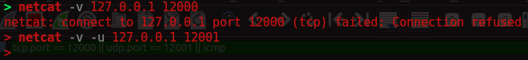

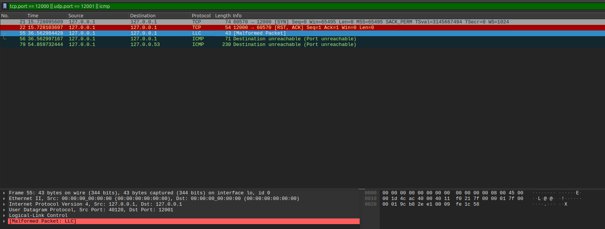

## 4) Servidor TCP mínimo

Un socket es el "punto final" de una comunicación que el sistema operativo le entrega a un programa: el programa escribe y lee bytes en el socket, y el sistema operativo se ocupa de TCP/UDP, IP y la placa de red.

Ahora hacemos nosotros lo que hacía ncat. Los scripts están resueltos para que puedan concentrarse en relacionar cada línea con lo que ocurre en la red.

> **c)** Ejecutar (capturando en loopback con el filtro `tcp.port == 12000`):

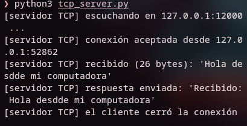

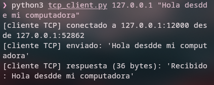

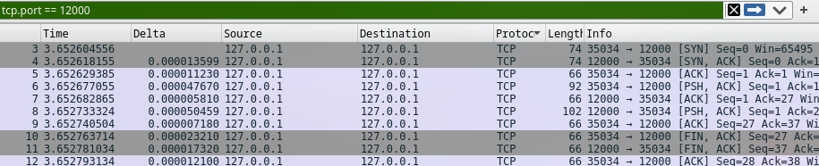

| Llamada | Dónde se ejecuta | Genera tráfico | Segmentos que se observan |
|---------|------------------|----------------|---------------------------|
| `socket()` | servidor y cliente | no | ninguno |
| `bind()` | servidor | no | ninguno |
| `listen()` | servidor | no | ninguno |
| `connect()` | cliente | sí | (3 SYN) (4 SYN, ACK) (5 ACK): el 3-way handshake |
| `accept()` | servidor | no | ninguno |
| `sendall()` | servidor y cliente | sí | Cliente: [PSH, ACK] Len=26 Servidor: [PSH, ACK] Len=26 |
| `recv()` | servidor y cliente | no | ninguno |
| `close()` | servidor y cliente | sí | Cliente: [FIN, ACK] Servidor: [FIN, ACK] Cliente: [ACK] |
